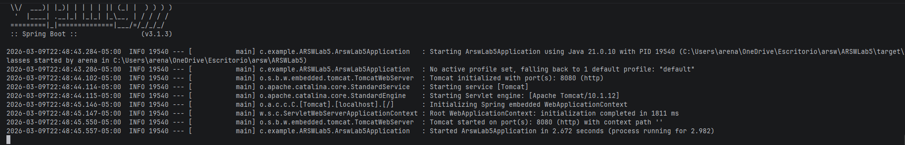
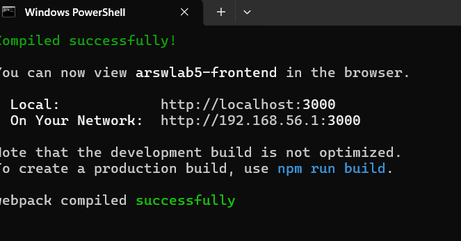
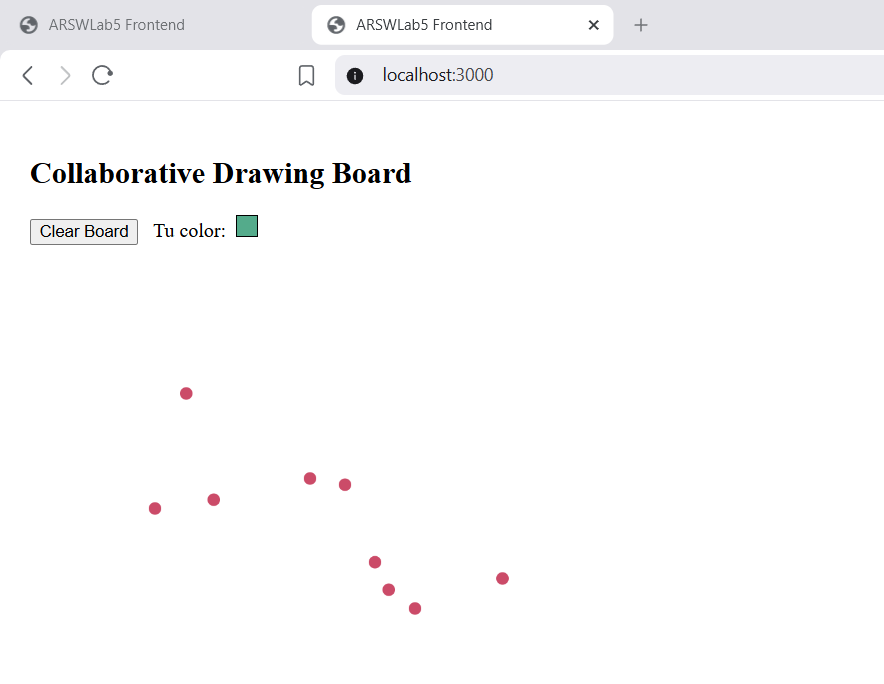
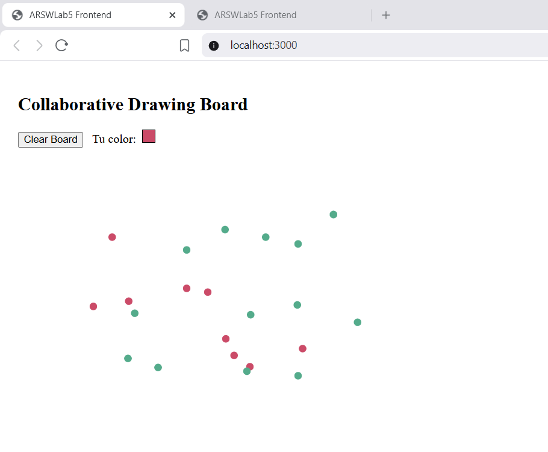
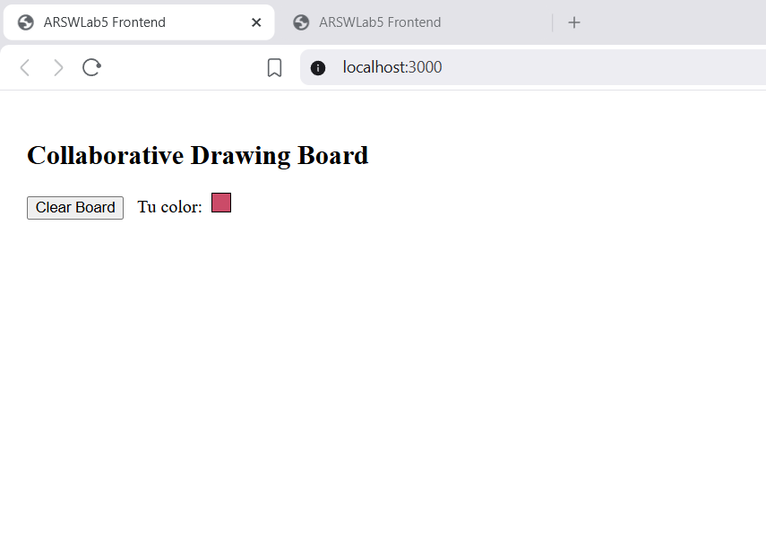

# ARSW Lab 5 - Collaborative Drawing Board

## 1. Descripción del laboratorio
Proyecto de laboratorio que implementa un tablero colaborativo donde múltiples usuarios dibujan en un canvas compartido. Cada usuario recibe un color aleatorio al abrir la aplicación; los trazos se comparten con otros clientes mediante un backend REST y polling periódico.

## 2. Objetivos
- Implementar comunicación cliente-servidor con REST API.
- Usar React y p5.js para la interfaz de dibujo.
- Sincronizar el estado entre clientes mediante polling cada 2 segundos.
- Implementar una operación global de borrado del tablero (Clear Board).

## 3. Tecnologías utilizadas
Frontend:
- React 18
- p5.js
- JavaScript
- Node.js, react-scripts

Backend:
- Java
- Spring Boot
- REST API
- CORS habilitado

Comunicación:
- HTTP/JSON

## 4. Arquitectura del sistema
Aplicación en dos capas:
- Frontend (React + p5.js): UI y lógica de dibujo y polling.
- Backend (Spring Boot): almacenamiento en memoria de puntos y endpoints REST.

La sincronización se hace mediante polling (setInterval cada 2000 ms) desde el frontend hacia el endpoint GET /points.

## 5. Estructura del proyecto
ARSWLab5
├── src (backend)
│   ├── main
│   │   └── java/com/example/ARSWLab5
│   │       ├── controller
│   │       ├── model
│   │       ├── service
│   │       └── ArsWLab5Application.java
└── frontend
    ├── public
    │   └── index.html
    └── src
        ├── index.js
        ├── App.js
        ├── CanvasBoard.js
        └── api.js

## 6. Explicación de cómo funciona el sistema
- El usuario abre la app (React) que crea un canvas con p5.js.
- Al presionar el mouse se crea un punto con {x,y,color,userId} y se envía por POST /points.
- Cada 2 segundos el frontend pide GET /points y actualiza el canvas con todos los puntos recibidos.
- Al presionar "Clear Board" el frontend llama DELETE /points; el backend borra su lista en memoria y la próxima petición GET refleja el tablero vacío.

## 7. Endpoints del backend
- GET /points
  - Descripción: devuelve lista de puntos actuales.
  - Respuesta: 200 OK, cuerpo JSON: [{x, y, color, userId}, ...]
- POST /points
  - Descripción: agrega un punto al tablero.
  - Cuerpo: JSON {x, y, color, userId}
  - Respuesta: 200 OK (sin contenido necesario)
- DELETE /points
  - Descripción: borra todos los puntos del tablero.
  - Respuesta: 200 OK

CORS: habilitado para permitir conexiones desde http://localhost:3000.

## 8. Cómo ejecutar el proyecto localmente

Prerequisitos:
- Java 17+ y Maven
- Node.js 16+ y npm

Backend:
1. Abrir terminal en la raíz del proyecto (donde está pom.xml).
2. Ejecutar:
   mvn spring-boot:run
3. Backend disponible en: http://localhost:8080

Frontend:
1. Abrir terminal en la carpeta frontend:
   cd frontend
2. Instalar dependencias:
   npm install
3. Iniciar servidor de desarrollo:
   npm start
4. Frontend disponible en: http://localhost:3000

Verifica que el backend esté corriendo en http://localhost:8080 antes de usar la interfaz.

## 9. Cómo probar el tablero con múltiples usuarios
- Abrir dos navegadores o pestañas (o un navegador y otro en modo incógnito).
- Ir a http://localhost:3000 en ambos.
- Dibujar en uno; esperar hasta 2 segundos para que el otro vea los puntos (polling).
- Presionar "Clear Board" en uno; ambos deberían ver el tablero vacío tras la próxima sincronización o inmediatamente si el frontend actualiza localmente.

## 10. Explicación de la sincronización entre usuarios
Se emplea polling en el frontend:
- setInterval ejecuta GET /points cada 2000 ms.
- El backend responde con la lista completa de puntos.
- El frontend actualiza su estado y redibuja el canvas.
Ventaja: implementación simple y fiable para un laboratorio. Desventaja: latencia y consumo de recursos en escenarios con muchos clientes.

## 11. Justificación de la arquitectura elegida
- Separación clara: frontend maneja UI y experiencia de usuario; backend es responsable del almacenamiento y la consistencia global.
- REST + polling es sencillo de implementar y suficiente para este ejercicio educativo.
- p5.js facilita la creación de canvas y dibujos sin complejidad gráfica baja.

## 12. Instrucciones para despliegue en AWS EC2

Resumen rápido (pasos básicos):
1. Crear instancia EC2 (por ejemplo Ubuntu 22.04).
2. Configurar Security Group:
   - Puerto 22 (SSH)
   - Puerto 8080 (HTTP backend)
   - (Opcional) Puerto 3000 si desea exponer el frontend en desarrollo (no recomendable para producción).
3. Conectar vía SSH:
   ssh -i tu-key.pem ubuntu@IP_PUBLICA
4. Instalar Java y Maven:
   sudo apt update
   sudo apt install -y openjdk-17-jdk maven
5. Clonar repo o transferir proyecto al servidor.
6. Construir y ejecutar backend:
   mvn clean package
   java -jar target/*.jar
   (Considerar usar nohup o systemd para ejecución persistente)
7. Asegurar que el Security Group permita tráfico al puerto 8080.

## 13. Cómo conectar el frontend con el backend desplegado
- Si el backend está en EC2 en IP pública X.Y.Z.W y acepta tráfico en 8080:
  - Actualizar en frontend/src/api.js la constante BASE:
    const BASE = "http://X.Y.Z.W:8080/points";
  - Rebuild o en modo desarrollo iniciar npm start (si se usa en máquina local, permitir CORS en backend para el origen local).
- Para producción, servir el frontend desde un servidor (nginx) y configurar proxy o usar el dominio y CORS adecuados.

## 14. Posibles mejoras futuras
- Reemplazar polling por WebSockets para latencia baja.
- Persistencia en base de datos (Postgres/Mongo) en lugar de memoria.
- Autenticación de usuarios y gestión de sesiones.
- Optimizar mensajes: enviar solo diffs en vez de la lista completa.
- Mejoras UI: grosor de pincel, formas, capas, guardar/recuperar dibujos.

## Pruebas de funcionamiento

### Ejecución del backend

[Espacio para screenshot del backend corriendo]

### Ejecución del frontend

[Espacio para screenshot del frontend corriendo]

### Prueba de múltiples usuarios

[Espacio para screenshot mostrando dos navegadores dibujando]

### Funcionamiento del botón Clear Board

[Espacio para screenshot del tablero borrándose]

## Despliegue en AWS

### Creación de la instancia EC2

[Espacio para screenshot de la instancia]

### Backend corriendo en AWS

[Espacio para screenshot del servidor corriendo]

### Prueba del tablero desde internet

